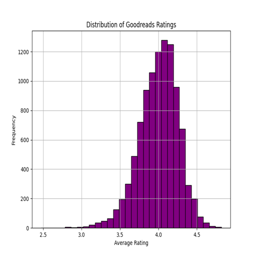
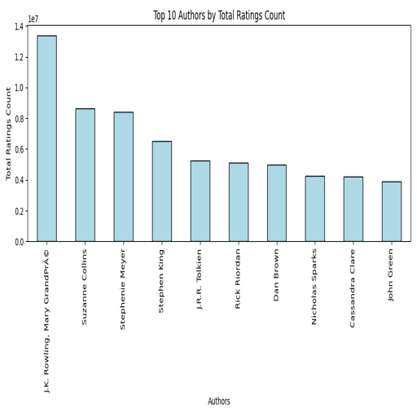
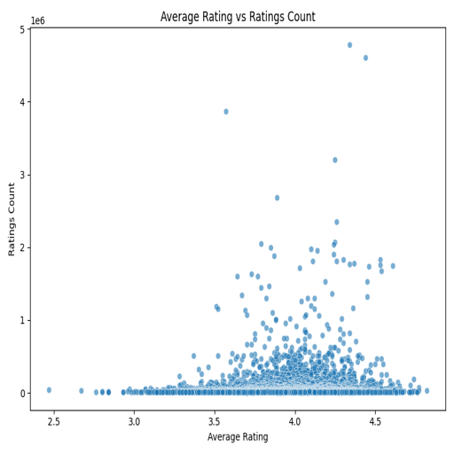
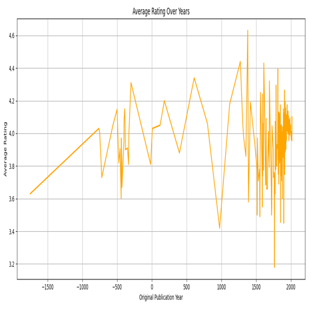

# Analysis Report

### Story of the Goodreads Dataset Analysis

In the quest to understand the literary landscape as perceived by readers, I delved into a comprehensive dataset obtained from Goodreads, a popular platform for book lovers. This dataset encompasses 10,000 entries, each representing a unique book, along with 23 attributes that capture various aspects of each book's characteristics and reception. The analysis aimed to unveil insights about book ratings, author popularity, publication trends, and the overall reading preferences of Goodreads users.

#### Dataset Overview

The dataset includes key columns such as `book_id`, `authors`, `original_publication_year`, `average_rating`, and several rating counts. The presence of missing values, particularly in the `isbn`, `isbn13`, `original_publication_year`, and `original_title` columns, indicates potential areas for data cleaning but does not detract significantly from the analysis. Most notably, the dataset contains detailed rating distributions across five categories, providing a nuanced view of reader sentiment.

#### Initial Statistical Analysis

A preliminary statistical summary revealed intriguing trends. The average rating of books stood at 4.00 out of 5, suggesting a generally favorable reception among readers. With a standard deviation of 0.25, the ratings were relatively consistent, indicating a high level of satisfaction among those who rated their reads. The `ratings_count` and `work_ratings_count` highlighted the disparity in popularity among books, with the highest-rated titles garnering millions of ratings, while others had significantly fewer.

The analysis of the `original_publication_year` showcased a fascinating trend: the mean publication year was around 1982, with a surprising range from 1750 to 2017. This suggests that modern readers are not only engaging with contemporary works but are also revisiting classic literature.

#### Visualization Insights

The data was further explored through a series of visualizations, each shedding light on different aspects of the dataset:

1. **Goodreads Ratings Distribution**: This visualization illustrated how ratings were spread across the five categories (1 to 5 stars). A marked skew towards higher ratings was evident, affirming the dataset's tendency towards positive reviews.

2. **Top Authors**: The analysis identified the most popular authors based on the number of ratings received. Authors like J.K. Rowling and Suzanne Collins emerged as central figures, indicating their significant impact on reader engagement and community discussions on Goodreads.

3. **Ratings vs. Count**: A scatter plot showed the relationship between `average_rating` and `ratings_count`. While a general trend towards higher ratings with increased counts was visible, notable outliers indicated that some books, despite high ratings, had surprisingly low engagement, potentially due to niche genres or limited marketing.

4. **Rating Trends Over Years**: This visualization traced the average ratings of books over publication years, revealing that newer publications generally received higher ratings than older ones. This trend could suggest evolving reader preferences or a shift in how ratings are given over time.

#### Insights and Implications

The analysis of the Goodreads dataset revealed several key insights:

- **Reader Preferences**: The tendency for higher ratings indicates a positive reader sentiment overall, which could suggest that readers gravitate towards certain genres or authors, leading to a self-reinforcing cycle of popularity.
  
- **Author Impact**: The prominence of specific authors in the dataset suggests that marketing and community engagement play crucial roles in a book’s success on platforms like Goodreads. Authors with strong followings can significantly skew ratings and visibility.

- **Engagement Disparities**: The findings also highlighted disparities in engagement, with a few books receiving a lion's share of ratings while many others languished in obscurity. This could prompt publishers and authors to rethink their marketing strategies and target demographics.

- **Temporal Trends**: The increasing ratings for more recent publications may reflect changing literary tastes or the impact of social media in shaping reader opinions. This insight can help publishers anticipate trends and align their offerings with reader preferences.

### Conclusion

The analysis of the

## Visualizations

