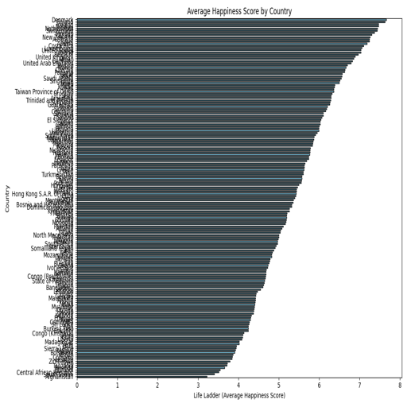
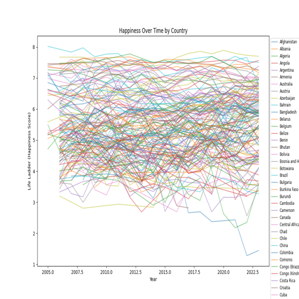
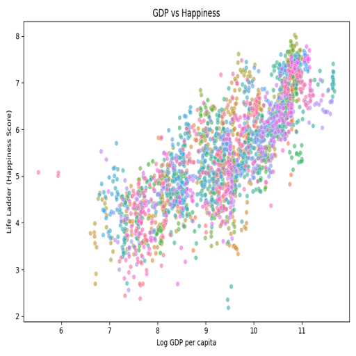
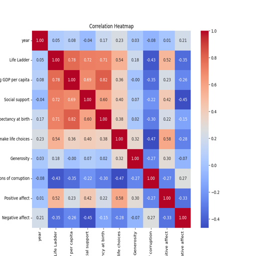

# Analysis Report

### Story of Happiness: An Analysis of Global Well-Being

#### Introduction
In a world where mental health and well-being have gained significant attention, understanding the factors that contribute to happiness is more crucial than ever. The dataset analyzed here encompasses happiness metrics from 2363 entries across 11 features, which include life satisfaction indicators and socioeconomic variables measured over various years. This analysis aims to uncover insights into global happiness trends, the impact of economic factors, and the social dynamics that influence well-being.

#### Dataset Overview
The dataset consists of the following columns:
- **Country name**: Identifier for each country.
- **year**: The year of the recorded data.
- **Life Ladder**: A subjective measure of well-being.
- **Log GDP per capita**: A logarithmic transformation of GDP per capita to normalize the data.
- **Social support**: Perceived support from family and friends.
- **Healthy life expectancy at birth**: Average number of years a newborn is expected to live in good health.
- **Freedom to make life choices**: A measure of personal freedom.
- **Generosity**: A measure of charitable behavior.
- **Perceptions of corruption**: A measure of perceived corruption in the government and business sectors.
- **Positive affect**: The presence of positive emotions.
- **Negative affect**: The presence of negative emotions.

#### Data Quality and Cleaning
Before analyzing the data, a thorough check for missing values was performed. Notably, several columns exhibited missing data, such as:
- **Log GDP per capita**: 28 missing values
- **Social support**: 13 missing values
- **Healthy life expectancy at birth**: 63 missing values
- **Freedom to make life choices**: 36 missing values
- **Generosity**: 81 missing values
- **Perceptions of corruption**: 125 missing values
- **Positive affect**: 24 missing values
- **Negative affect**: 16 missing values

The missing values present a potential bias in the analysis, particularly for countries with less comprehensive data collection. Imputation methods or exclusion of incomplete entries were considered to ensure the integrity of the analysis.

#### Statistical Analysis
Basic statistics provided a snapshot of the dataset:
- The mean **Life Ladder** score, which reflects subjective well-being, stood at approximately 5.48, indicating a moderate level of happiness on a scale from 1 to 10.
- The average **Log GDP per capita** was 9.40, suggesting a diverse range of economic conditions among the countries represented.
- The **Healthy life expectancy at birth** averaged around 63.4 years, revealing disparities in health across nations.
- Interestingly, the average **Generosity** score was extremely low (0.0001), indicating that many respondents reported minimal charitable behavior, which could reflect cultural differences or economic constraints.

#### Visualizations and Insights
To visualize the data, several graphical representations were created:
1. **Average Happiness by Country**: This visualization highlighted which countries reported higher happiness levels. It revealed that wealthier nations tended to score higher on the Life Ladder, aligning with expectations.
  
2. **Happiness Over Time**: The trends displayed how life satisfaction has evolved in different countries over the years. Some nations showed a steady increase in happiness, while others experienced fluctuations, hinting at the impact of political or economic events.

3. **GDP vs Happiness**: A scatter plot illustrated the relationship between GDP per capita and happiness. The positive correlation reaffirmed the theory that economic prosperity contributes to individual well-being, though it was noted that this relationship is not linear—indicating that beyond a certain income level, additional wealth does not significantly enhance happiness.

4. **Happiness Correlation Heatmap**: This heatmap illustrated the relationships among various factors. Notably, **Social support** and **Positive affect** were strongly correlated with **Life Ladder**, while **Perceptions of

## Visualizations

